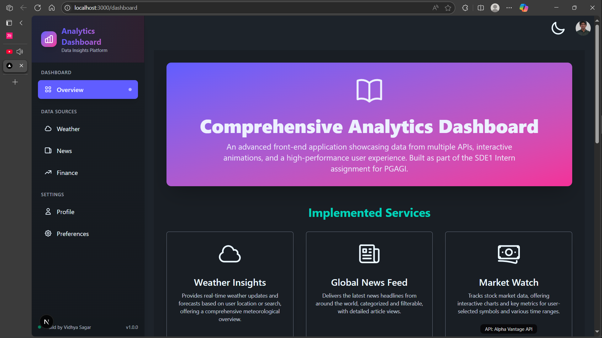
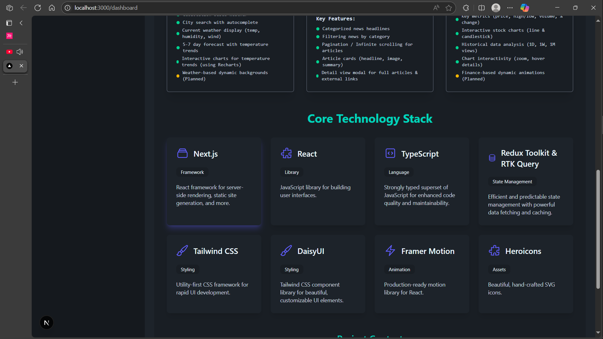
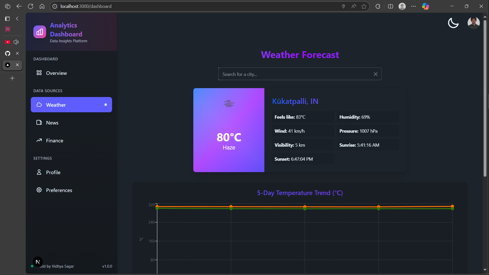
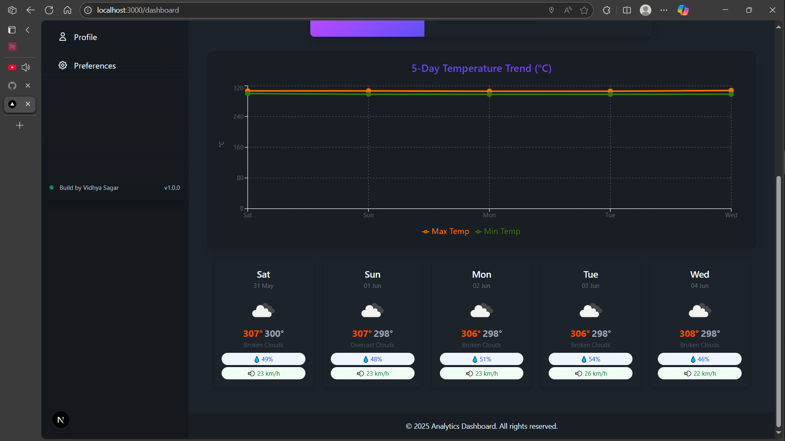
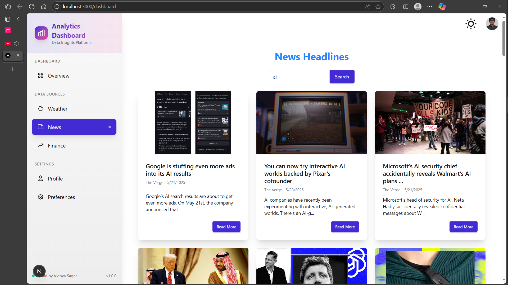
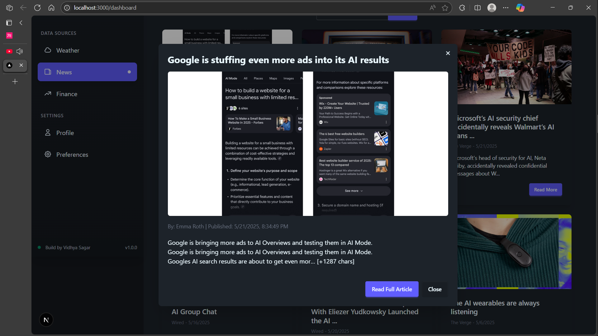
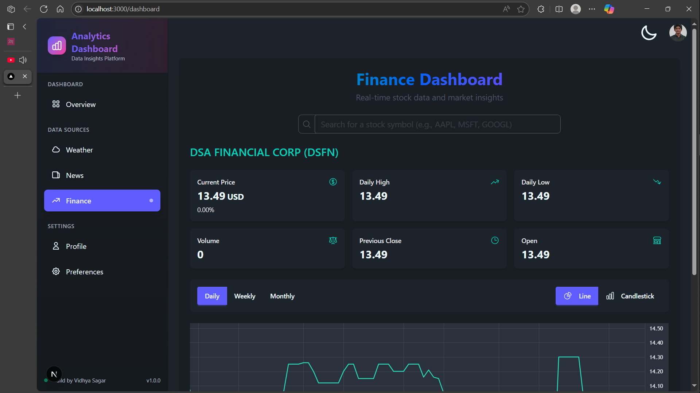
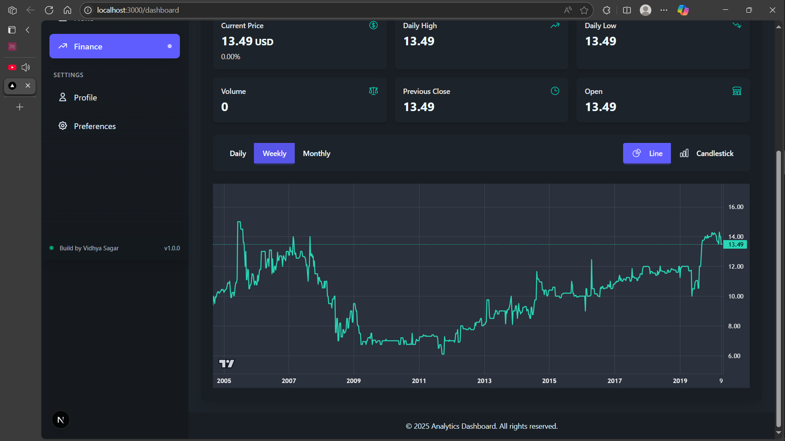
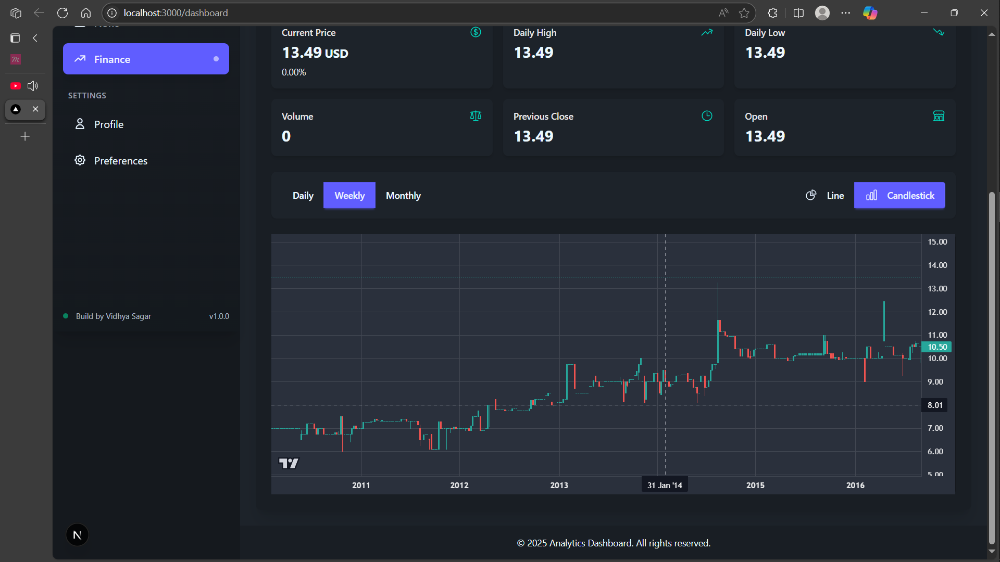

# PGAGI Comprehensive Analytics Dashboard

## Project Overview

This is an advanced front-end application developed "Comprehensive Analytics Dashboard" displays data fetched from multiple public APIs, incorporates interactive elements, and aims for a seamless, high-performance user experience.

The dashboard integrates three main services:
1. **Weather Insights:** Real-time weather information, 5-7 day forecasts, and city search functionality.
2. **Global News Feed:** Latest news articles, categorized and filterable, with detailed views.
3. **Market Watch:** Stock market data, interactive charts (line and candlestick), and key financial metrics for selected symbols.

It demonstrates best practices in modern front-end development, including state management, component-based architecture, API integration, and UI/UX design.

## Screenshots / GIFs












---

## Table of Contents

- [Features Implemented](#features-implemented)
- [Technologies Used](#technologies-used)
- [Prerequisites](#prerequisites)
- [API Keys Setup](#api-keys-setup)
- [Installation & Setup](#installation--setup)
- [Environment Variables](#environment-variables)
- [Running the Project](#running-the-project)
- [Project Structure](#project-structure)
- [Available Scripts](#available-scripts)
- [API Documentation](#api-documentation)
- [Deployment](#deployment)
- [Contributing](#contributing)

---

## Features Implemented

### General
- Responsive design adapting to mobile, tablet, and desktop
- Modular and reusable components
- Component-scoped styling using CSS Modules alongside global styles
- Customized Tailwind CSS configuration (colors, spacing, breakpoints)
- Strict TypeScript type checking
- Absolute imports and module path aliases
- Basic animations and transitions using Framer Motion
- Dashboard Overview page documenting features and tech stack

### Weather Service
- Display current weather information based on:
  - User's current geolocation (auto-detected)
  - User-specified location via search
- Search bar with autocomplete suggestions for city names (using GeoDB Cities API)
- Display a 5-7 day weather forecast including:
  - Temperature trends
  - Humidity, wind speed, and weather conditions
- Interactive charts for temperature over the next few days (using Recharts)

### News Service
- Display the latest news headlines categorized into sections (e.g., Technology, Sports, Business)
- News feed with article cards displaying headlines, images (if available), summaries, and source information
- Pagination or Infinite Scrolling for news articles
- Detail view modal for each article with full content (or summary) and external links

### Finance Service
- Search functionality with autocomplete for stock symbols (using Alpha Vantage API)
- Display near real-time stock market data for user-selected stock symbols
- Show key metrics: current price, daily high/low, volume, percentage change
- Interactive stock charts (using Lightweight Charts™):
  - Line charts for price over time
  - Candlestick charts for trading activity
- Historical data analysis with options to view data over different time ranges (Daily, Weekly, Monthly)
- Chart interactivity including zoom and hover details

---

## Technologies Used

### Core Framework & Language
- **Next.js:** React framework for server-side rendering, static site generation, routing, and API routes
- **React:** JavaScript library for building user interfaces
- **TypeScript:** Superset of JavaScript for static typing

### State Management
- **Redux Toolkit:** Official, opinionated, and batteries-included toolset for efficient Redux development
- **RTK Query:** Powerful data fetching and caching tool built into Redux Toolkit

### Styling
- **Tailwind CSS:** A utility-first CSS framework for rapid UI development
- **DaisyUI:** Tailwind CSS component library for pre-styled components
- **SCSS/CSS Modules:** For component-scoped styles and global style definitions

### Charting & Visualization
- **Recharts:** A composable charting library built on React components (used for Weather)
- **Lightweight Charts™ by TradingView:** High-performance financial charting library (used for Finance)

### Animations
- **Framer Motion:** Production-ready motion library for React

### Utility Libraries
- **Heroicons:** SVG icons
- **`use-debounce`:** For debouncing input in search functionalities

### Development Tools
- **ESLint:** For linting TypeScript/JavaScript code
- **Prettier:** For code formatting
- **Husky & lint-staged (Optional but Recommended):** For pre-commit hooks
- **Git & GitHub:** For version control and repository hosting

---

## Prerequisites

Before you begin, ensure you have the following installed on your system:

- **Node.js** (version 18.0 or higher)
- **npm** (version 9.0 or higher) or **yarn** (version 1.22 or higher)
- **Git** for version control

You can check your current versions by running:
```bash
node --version
npm --version
git --version
```

---

## API Keys Setup

This project requires API keys from multiple services. Follow the links below to obtain your API keys:

### 1. Weather APIs (RapidAPI)

**Open Weather API:**
- URL: https://rapidapi.com/worldapi/api/open-weather13
- Sign up for a RapidAPI account
- Subscribe to the "Open Weather API" service (free tier available)
- Copy your RapidAPI key from the dashboard

**GeoDB Cities API:**
- URL: https://rapidapi.com/wirefreethought/api/geodb-cities
- Subscribe to the "GeoDB Cities" service (free tier available)
- Use the same RapidAPI key from above

### 2. News API

**NewsAPI.org:**
- URL: https://newsapi.org/
- Sign up for a free account
- Navigate to your account dashboard
- Copy your API key

### 3. Finance API

**Alpha Vantage:**
- URL: https://www.alphavantage.co/support/#api-key
- Sign up for a free account
- Get your free API key (supports 25 requests per day)
- For higher limits, consider their premium plans

---

## Installation & Setup

### 1. Clone the Repository

```bash
git clone https://github.com/your-username/pgagi-analytics-dashboard.git
cd pgagi-analytics-dashboard
```

### 2. Install Dependencies

Using npm:
```bash
npm install
```

Using yarn:
```bash
yarn install
```

### 3. Create Environment Variables File

Create a `.env.local` file in the root directory:

```bash
cp .env.example .env.local
```

Or create it manually:
```bash
touch .env.local
```

---

## Environment Variables

Add the following environment variables to your `.env.local` file:

```env
# RapidAPI Key (for Weather APIs)
NEXT_PUBLIC_RAPIDAPI_KEY=your_rapidapi_key_here

# Alpha Vantage API Key (for Finance data)
NEXT_PUBLIC_ALPHA_VANTAGE_API_KEY=your_alpha_vantage_key_here

# NewsAPI.org Key (for News data)
NEXT_PUBLIC_NEWS_API_KEY=your_newsapi_key_here


### Environment Variables Explanation:

- **NEXT_PUBLIC_RAPIDAPI_KEY:** Your RapidAPI key for accessing weather services
- **NEXT_PUBLIC_ALPHA_VANTAGE_API_KEY:** Your Alpha Vantage API key for financial data
- **NEXT_PUBLIC_NEWS_API_KEY:** Your NewsAPI.org key for news articles

> **Note:** The `NEXT_PUBLIC_` prefix makes these variables accessible in the browser. Ensure you're comfortable with this for your use case.

---

## Running the Project

### Development Mode

Start the development server:

```bash
npm run dev
# or
yarn dev
```

Open [http://localhost:3000](http://localhost:3000) in your browser to see the application.

### Production Build

Build the application for production:

```bash
npm run build
# or
yarn build
```

Start the production server:

```bash
npm start
# or
yarn start
```

### Linting and Formatting

Run ESLint to check for code issues:

```bash
npm run lint
# or
yarn lint
```

Format code with Prettier:

```bash
npm run format
# or
yarn format
```

---

## Available Scripts

| Script | Description |
|--------|-------------|
| `npm run dev` | Starts the development server |
| `npm run build` | Builds the app for production |
| `npm start` | Runs the built app in production mode |
| `npm run lint` | Runs ESLint for code linting |
| `npm run lint:fix` | Runs ESLint and automatically fixes issues |
| `npm run format` | Formats code using Prettier |
| `npm run type-check` | Runs TypeScript compiler to check types |

---

## API Documentation

### Weather Service Endpoints

**Current Weather:**
```
GET https://open-weather13.p.rapidapi.com/city/{city}
Headers: X-RapidAPI-Key: {your_key}
```

**City Search:**
```
GET https://wft-geo-db.p.rapidapi.com/v1/geo/cities
Params: namePrefix={query}
Headers: X-RapidAPI-Key: {your_key}
```

### News Service Endpoints

**Top Headlines:**
```
GET https://newsapi.org/v2/top-headlines
Params: country=us&apiKey={your_key}
```

**Everything Search:**
```
GET https://newsapi.org/v2/everything
Params: q={query}&apiKey={your_key}
```

### Finance Service Endpoints

**Stock Quote:**
```
GET https://www.alphavantage.co/query
Params: function=GLOBAL_QUOTE&symbol={symbol}&apikey={your_key}
```

**Time Series Data:**
```
GET https://www.alphavantage.co/query
Params: function=TIME_SERIES_DAILY&symbol={symbol}&apikey={your_key}
```

---


## Troubleshooting

### Common Issues

**1. API Key Errors:**
- Ensure all API keys are correctly set in `.env.local`
- Check that API keys are active and have sufficient quota
- Verify the API key format matches the provider's requirements

**2. CORS Issues:**
- Use Next.js API routes for server-side API calls
- Check API provider's CORS policies

**3. Build Errors:**
- Run `npm run type-check` to identify TypeScript issues
- Ensure all dependencies are properly installed
- Clear `.next` folder and rebuild: `rm -rf .next && npm run build`

**4. Environment Variables Not Loading:**
- Restart the development server after changing `.env.local`
- Ensure environment variable names start with `NEXT_PUBLIC_` for client-side access
- Check for typos in variable names

### Getting Help

If you encounter issues:
1. Check the [Issues](https://github.com/your-username/pgagi-analytics-dashboard/issues) section
2. Review API provider documentation
3. Create a new issue with detailed error information

---

## Contributing

1. Fork the repository
2. Create a feature branch: `git checkout -b feature/amazing-feature`
3. Commit your changes: `git commit -m 'Add amazing feature'`
4. Push to the branch: `git push origin feature/amazing-feature`
5. Open a Pull Request

### Development Guidelines

- Follow TypeScript best practices
- Write meaningful commit messages
- Add tests for new features
- Update documentation as needed
- Follow the existing code style

---

## Acknowledgments

- [OpenWeatherMap](https://openweathermap.org/) for weather data
- [NewsAPI](https://newsapi.org/) for news articles
- [Alpha Vantage](https://www.alphavantage.co/) for financial data
- [RapidAPI](https://rapidapi.com/) for API marketplace
- [TradingView](https://www.tradingview.com/) for Lightweight Charts
- [Tailwind CSS](https://tailwindcss.com/) for styling framework

---

## Contact

**Developer:** [Vidhya sagar]  
**Email:** [vidhyasagargslv@gmail.com]  
 

**Project Link:** [[https://github.com/your-username/pgagi-analytics-dashboard](https://github.com/vidhyasagargslv/pgagi-analytics-dashboard)
